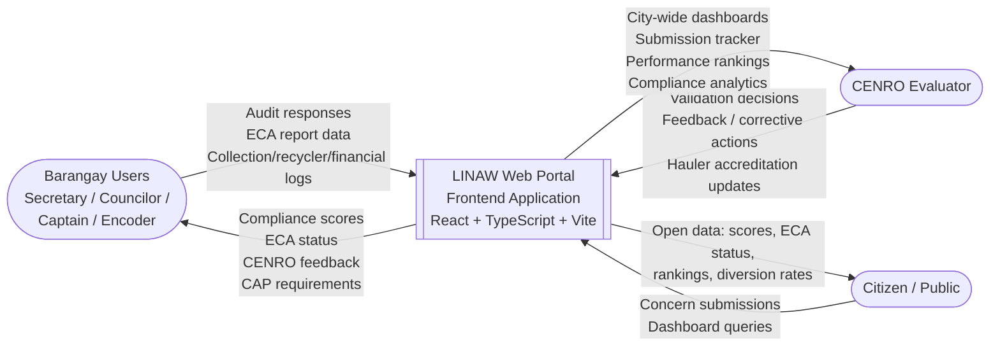
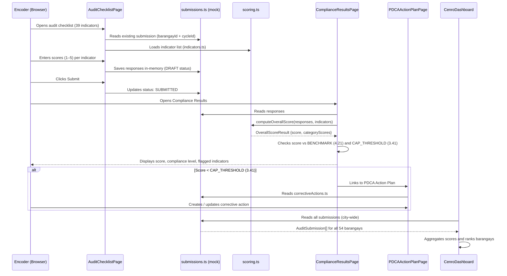
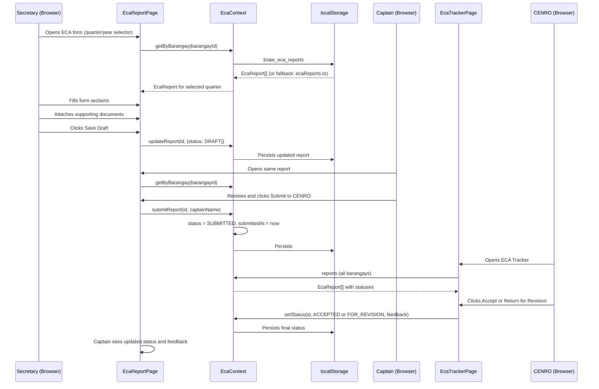

# LINAW Web Portal — Data Flow Diagram

> **Important:** The current implementation is **frontend-only**. There is no backend server or database. All data originates from static mock files in `src/data/`. Mutable state (ECA reports, feedback, user session) is persisted in the browser's `localStorage`. This document reflects the actual data flow of the prototype as implemented.

---

## Data Architecture Summary

| Layer | Technology | Purpose |
|---|---|---|
| Static seed data | `src/data/*.ts` files | Initial mock data for all entities |
| Runtime state | React Context (`EcaContext`, `FeedbackContext`, `AuthContext`) | Mutable in-session state |
| Client persistence | `localStorage` (browser) | Survives page refresh; simulates a database |
| Computed state | `src/lib/scoring.ts` | Derives compliance scores from indicator responses |
| UI | React components | Reads and displays state; writes mutations back to context |

**No API calls are made in the current prototype.** All reads and writes are in-memory or localStorage.

---

## Level 0 — Context Diagram

---

## Level 1 — Internal Data Flow

```mermaid
flowchart TD
    subgraph SEED["Seed Data — src/data/"]
        SD1[barangays.ts\n54 Barangay records]
        SD2[indicators.ts\n39 AuditIndicators]
        SD3[submissions.ts\n54 AuditSubmissions\n+ scores + responses]
        SD4[ecaReports.ts\nEcaReport records\nper barangay/quarter]
        SD5[feedbacks.ts\nCenroFeedback records]
        SD6[haulers.ts\nHaulerRecord list]
        SD7[financials.ts\nFinancialRecord per month]
        SD8[recyclers.ts\nRecyclerEntry + recovery]
        SD9[collectionLogs.ts\nCollectionLog entries]
        SD10[correctiveActions.ts\nCorrectiveAction records]
        SD11[users.ts\nAppUser presets per role]
    end

    subgraph CTX["React Context — Runtime State"]
        CTX1[AuthContext\nuser: AppUser\nlocalstorage: linaw_user]
        CTX2[EcaContext\nreports: EcaReport\nlocalstorage: linaw_eca_reports]
        CTX3[FeedbackContext\nfeedbacks: CenroFeedback\nlocalstorage: linaw_feedbacks]
        CTX4[ToastContext\ntoasts: Toast\ntransient only]
    end

    subgraph COMPUTE["Computed Data — src/lib/scoring.ts"]
        COMP1[computeOverallScore\nresponses × indicators → OverallScoreResult]
        COMP2[computeCategoryScore\nper IndicatorCategory]
        COMP3[getComplianceLevel\nscore → ComplianceLevel enum]
        COMP4[getScoreColor / getBarColor\nscore → Tailwind color string]
    end

    subgraph PAGES["UI Pages — Reads and Writes"]
        PG1[LoginPage\nReads: SD11\nWrites: CTX1]
        PG2[AuditChecklistPage\nReads: SD2, SD3\nWrites: SD3 in-memory]
        PG3[EvidenceRepositoryPage\nReads: SD3\nWrites: SD3 in-memory]
        PG4[ComplianceResultsPage\nReads: SD3, COMP1-4\nDisplays: scores + CAP flags]
        PG5[EcaReportPage\nReads: CTX2\nWrites: CTX2]
        PG6[EcaTrackerPage\nReads: CTX2, SD1\nWrites: CTX2 status]
        PG7[FeedbackViewPage\nReads: CTX3\nWrites: CTX3 status + response]
        PG8[FeedbackManagementPage\nReads: CTX3, SD1\nWrites: CTX3]
        PG9[FinancialSummaryPage\nReads: SD7]
        PG10[RecyclerRegistryPage\nReads: SD8\nWrites: SD8 in-memory]
        PG11[CollectionMonitoringPage\nReads: SD9\nWrites: SD9 in-memory]
        PG12[PDCAActionPlanPage\nReads: SD10, SD3\nWrites: SD10 in-memory]
        PG13[PublicDashboard\nReads: SD1, SD3 - public subset only]
        PG14[CenroDashboard\nReads: SD1, SD3, CTX2, SD9, SD5]
    end

    subgraph LS["localStorage — Persistence"]
        LS1[linaw_user]
        LS2[linaw_eca_reports]
        LS3[linaw_feedbacks]
    end

    %% Seed → Context initialization
    SD4 -->|fallback seed| CTX2
    SD5 -->|fallback seed| CTX3
    SD11 -->|preset lookup| CTX1

    %% Context → localStorage
    CTX1 <--> LS1
    CTX2 <--> LS2
    CTX3 <--> LS3

    %% Seed → Pages (direct import, read-only)
    SD1 --> PG14
    SD2 --> PG2
    SD3 --> PG2
    SD3 --> PG3
    SD3 --> PG4
    SD3 --> PG14
    SD3 --> PG13
    SD6 -.->|HaulerAccreditationPage| PG14
    SD7 --> PG9
    SD8 --> PG10
    SD9 --> PG11
    SD10 --> PG12

    %% Context → Pages
    CTX1 --> PG1
    CTX2 --> PG5
    CTX2 --> PG6
    CTX3 --> PG7
    CTX3 --> PG8

    %% Scoring computation
    SD3 --> COMP1
    SD2 --> COMP1
    COMP1 --> PG4
    COMP2 --> PG4
    COMP3 --> PG4
    COMP4 --> PG2

    %% User action writes
    PG5 -->|updateReport / submitReport| CTX2
    PG6 -->|setStatus| CTX2
    PG7 -->|updateStatus + barangayResponse| CTX3
    PG8 -->|issueFeedback| CTX3
```

---

## Data Flow: RA 9003 Audit Submission

---

## Data Flow: ECA Quarterly Reporting

---

## localStorage Keys Reference

| Key | Context | Type | Fallback |
|---|---|---|---|
| `linaw_user` | `AuthContext` | `AppUser \| null` | Logged out state |
| `linaw_eca_reports` | `EcaContext` | `EcaReport[]` | `mockEcaReports` from `ecaReports.ts` |
| `linaw_feedbacks` | `FeedbackContext` | `CenroFeedback[]` | `mockFeedbacks` from `feedbacks.ts` |

All other data (audit submissions, collection logs, financials, recyclers, haulers, IEC activities) is read directly from static mock files and is **not persisted** across page refreshes in the current prototype. Full persistence would require a backend API or expanding localStorage usage.
