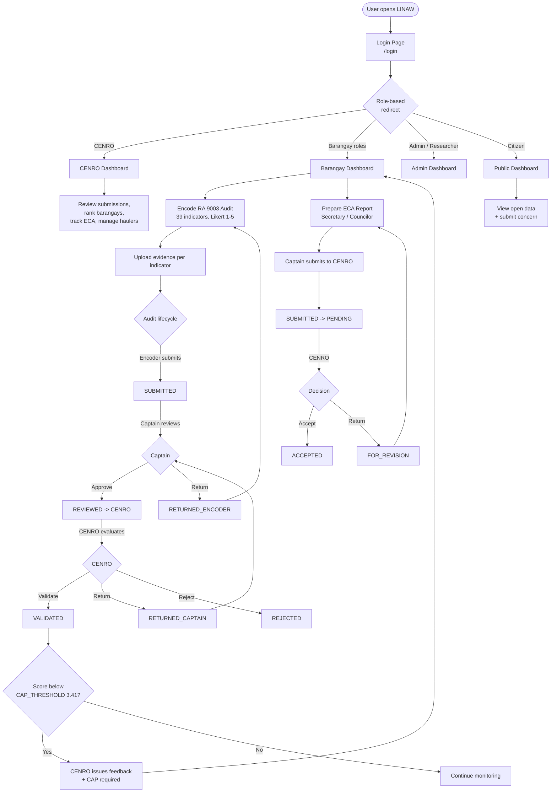
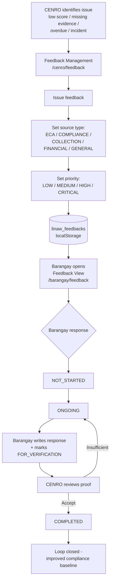
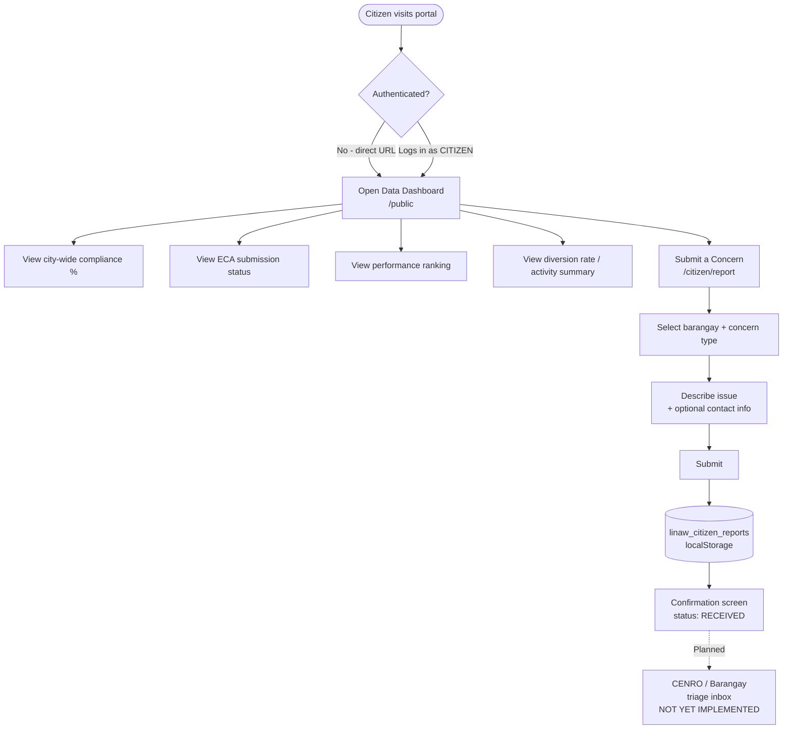
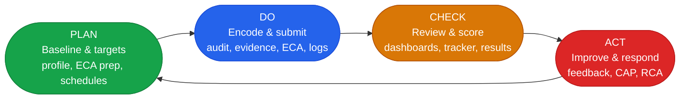

# LINAW Web Portal — System Workflow

**LINAW** — Localized Initiative for Networked Applications on Waste Management
**Jurisdiction:** Calamba City, Laguna — 54 Barangays
**Legal Basis:** Republic Act No. 9003 (Ecological Solid Waste Management Act of 2000)

> This document describes the **actual implemented workflow** of the LINAW prototype, derived from the codebase (routes, contexts, pages, and mock data). Features that exist only as static/mock reads or are not yet wired to a consumer are explicitly labeled **mock/static**, **placeholder**, or **planned**.

---

## 1. System Overview

LINAW is a role-based RA 9003 compliance monitoring portal that digitalizes the barangay solid waste management reporting and governance cycle for Calamba City. It serves three constituencies — **CENRO** (city evaluators), **Barangay officials** (encoders, secretaries, councilors, captains), and the **public** (citizens).

**Technical reality of the current prototype:**

| Aspect | Implementation |
|---|---|
| Architecture | **Frontend-only** — React 19 + TypeScript + Vite + Tailwind CSS |
| Backend | **None.** No API, no server, no database |
| State | React Context providers (`AuthContext`, `EcaContext`, `FeedbackContext`, `ToastContext`) |
| Persistence | Browser `localStorage` for select entities; remaining data is in-memory mock seeded from `src/data/` |
| Scoring | Computed client-side in `src/lib/scoring.ts` |

**Domain constants** (`src/lib/scoring.ts`):
- **BENCHMARK = 4.21** — full-compliance threshold; indicators below this are flagged
- **CAP_THRESHOLD = 3.41** — below this, a Corrective Action Plan (CAP) is required
- **Likert scale:** 1 (Non-Compliant) → 5 (Fully Compliant)
- **39 audit indicators** across 4 categories: SWM Programs (11), Committee (9), Waste Collection & Fees (9), Environmental & Community Impact (10)

---

## 2. User Roles and Access

Eight roles are defined in `AuthContext`. On login the user is routed to a role-appropriate landing page.

| Role | Scope | Login Redirect | Core Capability |
|---|---|---|---|
| `CENRO_EVALUATOR` | All 54 barangays | `/cenro/dashboard` | Monitor, review, validate, issue feedback |
| `BARANGAY_SECRETARY` | Own barangay | `/barangay/dashboard` | Encode ECA draft + operational logs |
| `BARANGAY_COUNCILOR` | Own barangay | `/barangay/dashboard` | Encode ECA draft + operational logs |
| `BARANGAY_CAPTAIN` | Own barangay | `/barangay/dashboard` | **Submit ECA to CENRO**, endorse audit |
| `BARANGAY_ENCODER` | Own barangay | `/barangay/dashboard` | Legacy encoder (audit + ECA) |
| `SYSTEM_ADMIN` | System-wide | `/dashboard` | Full access + user management |
| `RESEARCHER` | Read-only analytics | `/dashboard` | Cross-barangay analysis, reports |
| `CITIZEN` | Public | `/public` | View open data, submit concern |

**RBAC helpers** (from `useAuth()`): `hasRole(...roles)`, `canEdit()`, `canValidate()`, `canAdmin()`. Every page and sidebar item is gated by these.

**Key gating rule:** The "Submit to CENRO" action on the ECA form is restricted to `BARANGAY_CAPTAIN` only. Secretaries and councilors prepare and save drafts; the captain certifies and submits — mirroring the real Manila Bayanihan Form 2.2 sign-off chain (Committee Chair accomplishes → Punong Barangay certifies).

---

## 3. End-to-End Workflow

---

## 4. Module Workflow

The portal implements 13 functional modules. The table notes the route and the **honest persistence state** of each.

### CENRO Governance

| Module | Route | Persistence |
|---|---|---|
| CENRO Dashboard | `/cenro/dashboard` | Reads mock/static (`submissions.ts`, `barangays.ts`) |
| ECA Tracker | `/cenro/eca-tracker` | **Persisted** via `EcaContext` → `localStorage.linaw_eca_reports` |
| Performance Ranking | `/cenro/ranking` | Reads mock/static |
| Hauler Accreditation | `/cenro/haulers` | Mock/static (`haulers.ts`) — edits in-memory only |
| Feedback Management | `/cenro/feedback` | **Persisted** via `FeedbackContext` → `localStorage.linaw_feedbacks` |

### Barangay Compliance

| Module | Route | Persistence |
|---|---|---|
| Barangay Dashboard | `/barangay/dashboard` | Reads mock/static + `EcaContext` |
| RA 9003 Audit Checklist | `/audit` | Mock/static (`submissions.ts`) — edits in-memory only |
| Evidence Repository | `/evidence` | Mock/static — uploads are in-memory only |
| Compliance Results | `/results` | Reads mock/static + live `scoring.ts` computation |
| ECA Report | `/barangay/eca` | **Persisted** via `EcaContext` |

### Barangay Operations

| Module | Route | Persistence |
|---|---|---|
| Collection Monitoring | `/barangay/collection` | Mock/static (`collectionLogs.ts`) — in-memory edits |
| Recycler Registry | `/barangay/recyclers` | Mock/static (`recyclers.ts`) — in-memory edits |
| Financial Summary | `/barangay/financial` | Mock/static (`financials.ts`) — read-only display |
| Incident Reports | `/barangay/incidents` | Mock/static — in-memory only |
| IEC Activities | `/barangay/iec` | Mock/static (`iecActivities.ts`) — in-memory edits |

### Cross-cutting & Public

| Module | Route | Persistence |
|---|---|---|
| PDCA Action Plan | `/action-plan` | Mock/static (`correctiveActions.ts`) — in-memory edits |
| Root Cause Analysis | `/rca` | Mock/static — analysis tool, in-memory |
| Reports / Export | `/reports` | **Placeholder** — export buttons are non-functional stubs |
| Open Data Dashboard | `/public` | Reads mock/static (public subset) — no auth |
| Citizen Report | `/citizen/report` | Writes to `localStorage.linaw_citizen_reports` — **no reader page yet (planned triage inbox)** |

> **Persistence summary:** Only **three** entities survive a page refresh today — the user session (`linaw_user`), ECA reports (`linaw_eca_reports`), and CENRO feedback (`linaw_feedbacks`). Citizen reports are written to `linaw_citizen_reports` but no implemented page reads them back. All other module edits are in-memory and reset on reload. Full persistence is **planned** via a future backend API.

---

## 5. CENRO-to-Barangay Feedback Workflow

Feedback is the formal corrective-action channel between CENRO and barangays, managed by `FeedbackContext` (persisted to `localStorage.linaw_feedbacks`).

**Feedback attributes:**
- **Source type:** `ECA` · `COMPLIANCE` · `COLLECTION` · `FINANCIAL` · `GENERAL`
- **Priority:** `LOW` · `MEDIUM` · `HIGH` · `CRITICAL`
- **Response status:** `NOT_STARTED → ONGOING → FOR_VERIFICATION → COMPLETED`

---

## 6. Citizen / Public Dashboard Workflow

Two routes are publicly accessible with **no authentication** — `/public` and `/citizen/report`.

**Implementation notes:**
- The Open Data Dashboard reads the same mock/static `submissions.ts` and `barangays.ts`, exposing only a public-safe subset (scores, statuses, rankings).
- The citizen concern form **does** persist each submission to `localStorage.linaw_citizen_reports` with status `RECEIVED`.
- **Placeholder/planned:** There is no implemented CENRO or barangay page that reads, acknowledges, or resolves citizen reports. The `ACKNOWLEDGED → RESOLVED` lifecycle exists in the type definition but has no UI consumer yet.

---

## 7. PDCA Alignment

The portal maps onto the Plan-Do-Check-Act continuous improvement cycle.

| Phase | Purpose | Implemented Modules (routes) |
|---|---|---|
| **PLAN** | Establish baseline & targets | Barangay Profile (`/barangays`), ECA draft prep (`/barangay/eca`), Collection schedule (`/barangay/collection`), Recycler registry (`/barangay/recyclers`), IEC calendar (`/barangay/iec`) |
| **DO** | Encode, submit, log activity | RA 9003 Audit (`/audit`), Evidence upload (`/evidence`), ECA submission (`/barangay/eca`), Incident (`/barangay/incidents`), Financial (`/barangay/financial`) |
| **CHECK** | Review, score, track | CENRO Dashboard (`/cenro/dashboard`), ECA Tracker (`/cenro/eca-tracker`), Compliance Results (`/results`), Performance Ranking (`/cenro/ranking`), Reports (`/reports`) |
| **ACT** | Improve, respond, close loop | Feedback Mgmt (`/cenro/feedback`), Feedback View (`/barangay/feedback`), PDCA Action Plan (`/action-plan`), Root Cause Analysis (`/rca`) |

---

## 8. Status & Threshold Reference

**RA 9003 Audit lifecycle:**
`DRAFT → SUBMITTED → REVIEWED → VALIDATED`
(branches: `RETURNED_ENCODER`, `RETURNED_CAPTAIN`, `REJECTED`)

**ECA Quarterly Report lifecycle:**
`DRAFT → SUBMITTED → PENDING → ACCEPTED`
(branches: `FOR_REVISION`, `OVERDUE`)

**Feedback response lifecycle:**
`NOT_STARTED → ONGOING → FOR_VERIFICATION → COMPLETED`

**Citizen report lifecycle (type-defined; UI partial):**
`RECEIVED → ACKNOWLEDGED → RESOLVED` (only `RECEIVED` is reachable in current UI)

**Scoring thresholds:**
- BENCHMARK = **4.21** (full compliance; below = flagged)
- CAP_THRESHOLD = **3.41** (below = Corrective Action Plan required)

**localStorage keys in use:**

| Key | Owner | Persisted? |
|---|---|---|
| `linaw_user` | `AuthContext` | Yes |
| `linaw_eca_reports` | `EcaContext` | Yes |
| `linaw_feedbacks` | `FeedbackContext` | Yes |
| `linaw_citizen_reports` | `CitizenReportPage` | Yes (write-only; no reader) |

All other entities (audit submissions, collection logs, recyclers, financials, IEC, haulers, corrective actions) are in-memory mock reads that reset on page reload.

---

*To preview this document with rendered diagrams: open in VS Code with the `bierner.markdown-mermaid` extension and press `Cmd+Shift+V`, or view on GitHub (native Mermaid rendering). See [`README_DIAGRAM_GUIDE.md`](README_DIAGRAM_GUIDE.md) for details.*
