# LINAW Web Portal — Module Interaction Diagram

This document maps how the major modules of the LINAW portal interact with each other, based on the implemented routes, context providers, and data dependencies.

---

## Module Overview

The portal is organized into six functional clusters:

| Cluster | Modules |
|---|---|
| **Entry** | Authentication, Smart Redirect |
| **CENRO Governance** | CENRO Dashboard, ECA Tracker, Performance Ranking, Hauler Accreditation, Feedback Management |
| **Barangay Compliance** | Barangay Dashboard, RA 9003 Audit, Evidence Upload, ECA Reporting |
| **Barangay Operations** | Collection Monitoring, Recycler Registry, Financial Summary, Incident Reporting, IEC Activities |
| **Cross-cutting** | Feedback / Corrective Action, PDCA Action Plan, Root Cause Analysis, Reports |
| **Public Access** | Open Data Dashboard, Citizen Concern Reporting |

---

## Full Module Interaction Diagram

```mermaid
graph TB
    subgraph AUTH["Authentication Layer"]
        A1[Login Page\n/login]
        A2[AuthContext\nlocalStorage: linaw_user]
        A3[RequireAuth Guard\nprotected routes]
    end

    subgraph CENRO["CENRO Governance Cluster"]
        C1[CENRO Dashboard\n/cenro/dashboard]
        C2[ECA Tracker\n/cenro/eca-tracker]
        C3[Performance Ranking\n/cenro/ranking]
        C4[Hauler Accreditation\n/cenro/haulers]
        C5[Feedback Management\n/cenro/feedback]
    end

    subgraph BRGY["Barangay Compliance Cluster"]
        B1[Barangay Dashboard\n/barangay/dashboard]
        B2[RA 9003 Audit Checklist\n/audit]
        B3[Evidence Repository\n/evidence]
        B4[Compliance Results\n/results]
    end

    subgraph ECA["ECA Reporting Cluster"]
        E1[ECA Report Form\n/barangay/eca]
        E2[EcaContext\nlocalStorage: linaw_eca_reports]
    end

    subgraph OPS["Barangay Operations Cluster"]
        O1[Collection Monitoring\n/barangay/collection]
        O2[Recycler Registry\n/barangay/recyclers]
        O3[Financial Summary\n/barangay/financial]
        O4[Incident Reports\n/barangay/incidents]
        O5[IEC Activities\n/barangay/iec]
    end

    subgraph FEEDBACK["Feedback / PDCA Cluster"]
        F1[Feedback View\n/barangay/feedback]
        F2[Feedback Management\n/cenro/feedback]
        F3[FeedbackContext\nlocalStorage: linaw_feedbacks]
        F4[PDCA Action Plan\n/action-plan]
        F5[Root Cause Analysis\n/rca]
    end

    subgraph PUBLIC["Public / Open Data Cluster"]
        P1[Open Data Dashboard\n/public]
        P2[Citizen Report\n/citizen/report]
    end

    subgraph DATA["Mock Data Layer\nsrc/data/"]
        D1[barangays.ts\n54 barangays]
        D2[indicators.ts\n39 indicators]
        D3[submissions.ts\nAudit submissions]
        D4[ecaReports.ts\nECA reports]
        D5[feedbacks.ts\nCENRO feedbacks]
        D6[haulers.ts\nHauler records]
        D7[financials.ts\nFinancial records]
        D8[recyclers.ts\nRecycler entries]
        D9[collectionLogs.ts\nCollection logs]
        D10[correctiveActions.ts\nCAP records]
    end

    %% Auth flow
    A1 --> A2
    A2 --> A3
    A3 --> CENRO
    A3 --> BRGY
    A3 --> ECA
    A3 --> OPS
    A3 --> FEEDBACK

    %% CENRO reads from data
    C1 --> D1
    C1 --> D3
    C2 --> E2
    C3 --> D3
    C4 --> D6
    C5 --> F3

    %% Barangay compliance
    B1 --> D3
    B1 --> E2
    B2 --> D2
    B2 --> D3
    B3 --> D3
    B4 --> D3

    %% ECA
    E1 --> E2
    E2 --> D4
    C2 --> E2

    %% Operations
    O1 --> D9
    O2 --> D8
    O3 --> D7
    O4 -.->|incident data| C1
    O5 -.->|IEC summary| C1

    %% Feedback loop
    F2 --> F3
    F1 --> F3
    F3 --> D5
    F4 --> D10
    F5 --> D10
    B4 --> F4

    %% CENRO sees ops summary
    C1 -.->|aggregates| O1
    C1 -.->|aggregates| O4

    %% Public
    P1 --> D1
    P1 --> D3
    P1 -.->|no auth required| A3
    P2 -.->|anonymous submission| A3

    %% Score thresholds drive CAP
    B4 -->|score below CAP_THRESHOLD 3.41| F4
    B4 -->|score below BENCHMARK 4.21| C5
```

---

## Key Inter-Module Dependencies

### ECA Context (`EcaContext`)
The `EcaContext` is the single source of truth for ECA reports. It is consumed by:
- `EcaReportPage` — barangay encodes and captain submits
- `EcaTrackerPage` — CENRO reviews and accepts/returns
- `BarangayDashboard` — shows latest ECA status widget

### Feedback Context (`FeedbackContext`)
The `FeedbackContext` is shared between CENRO and barangay sides:
- `FeedbackManagementPage` (CENRO) — issues feedback, tracks resolution
- `FeedbackViewPage` (Barangay) — views and responds to CENRO feedback

### Compliance Score → CAP Trigger
The `ComplianceResultsPage` computes category and overall scores using `scoring.ts`. When a score falls below the `CAP_THRESHOLD` (3.41), the PDCA Action Plan module is triggered to require a Corrective Action Plan.

### Evidence → Audit Submission
Evidence files are linked to specific `indicatorId` entries in the audit submission. The `EvidenceRepositoryPage` reads and displays evidence attached to the current submission.

### Collection / Recycler / Financial → CENRO Dashboard
Summary statistics from operational logs (collection volume, recycling income, incident count) are aggregated and surfaced in the `CenroDashboard` city-wide overview.

---

## Module Dependency Table

| Module | Reads From | Writes To | Connected To |
|---|---|---|---|
| Login | `mockUsers`, `ROLE_LOGIN_PRESETS` | `localStorage.linaw_user` | All protected routes |
| CENRO Dashboard | `barangays.ts`, `submissions.ts` | — | ECA Tracker, Feedback Mgmt |
| ECA Tracker | `EcaContext` | `EcaContext` (status updates) | Barangay ECA Form |
| Performance Ranking | `submissions.ts` | — | CENRO Dashboard |
| Hauler Accreditation | `haulers.ts` | `haulers.ts` (mock) | CENRO Dashboard |
| Feedback Management | `FeedbackContext` | `FeedbackContext` | Barangay Feedback View |
| Barangay Dashboard | `submissions.ts`, `EcaContext` | — | Audit, ECA, Operations |
| RA 9003 Audit | `indicators.ts`, `submissions.ts` | `submissions.ts` (mock) | Evidence Upload, Results |
| Evidence Repository | `submissions.ts` | `submissions.ts` (mock) | Audit Checklist |
| Compliance Results | `submissions.ts`, `scoring.ts` | — | PDCA Action Plan |
| ECA Report Form | `EcaContext` | `EcaContext` | ECA Tracker |
| Collection Monitoring | `collectionLogs.ts` | `collectionLogs.ts` (mock) | CENRO Dashboard |
| Recycler Registry | `recyclers.ts` | `recyclers.ts` (mock) | Financial Summary |
| Financial Summary | `financials.ts` | `financials.ts` (mock) | — |
| Incident Reports | — | — | CENRO Dashboard |
| IEC Activities | `iecActivities.ts` | `iecActivities.ts` (mock) | — |
| PDCA Action Plan | `correctiveActions.ts`, `submissions.ts` | `correctiveActions.ts` (mock) | RCA, Compliance Results |
| Root Cause Analysis | `correctiveActions.ts` | `correctiveActions.ts` (mock) | PDCA Action Plan |
| Open Data Dashboard | `barangays.ts`, `submissions.ts` | — | — |
| Citizen Report | — | CitizenReport (mock) | — |
