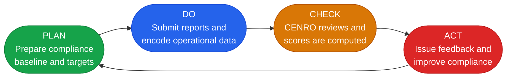
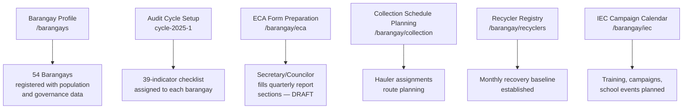
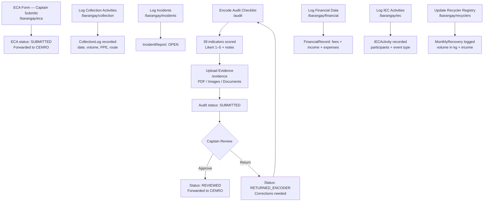
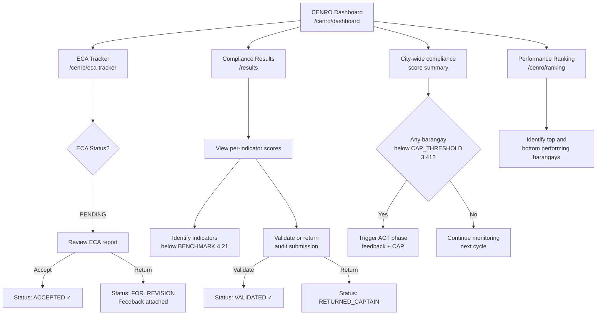
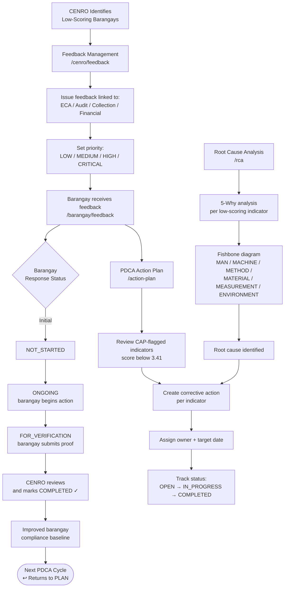

# LINAW Web Portal — PDCA Workflow Mapping

The LINAW portal is structured around the **Plan-Do-Check-Act (PDCA)** continuous improvement cycle as the governance framework for RA 9003 barangay compliance monitoring. This document maps each phase of the PDCA cycle to the implemented modules and workflows.

---

## PDCA Overview

---

## PLAN — Establish Compliance Baseline and Targets

> **Purpose:** Set up the governance structure, identify the reporting scope, and prepare barangay-level compliance documentation before the submission cycle begins.

### Portal Modules in this Phase

| Module | Route | Description |
|---|---|---|
| Barangay Profile | `/barangays` | Establishes the 54-barangay registry with population, district, captain, and contact details |
| RA 9003 Audit Checklist | `/audit` | 39 indicators across 4 categories prepared for scoring (DRAFT state) |
| ECA Quarterly Reporting | `/barangay/eca` | ECA form prepared by Secretary/Councilor for the reporting quarter |
| Recycler Registry | `/barangay/recyclers` | Recycler network mapped; baseline monthly recovery volumes established |
| Collection Monitoring | `/barangay/collection` | Collection schedule and hauler assignments planned |
| IEC Activities | `/barangay/iec` | IEC campaign calendar prepared |

### Key Data Objects
- `Barangay` records — 54 barangays, Calamba City
- `AuditCycle` — defines the period (semester, year, active dates)
- `AuditSubmission` (DRAFT) — blank submissions seeded per cycle
- `EcaReport` (DRAFT) — quarterly report prepared but not submitted

---

## DO — Encode, Submit, and Log Compliance Activities

> **Purpose:** Barangay users execute their compliance tasks and submit documentation to the system for the active audit cycle.

### Portal Modules in this Phase

| Module | Route | Actor | Description |
|---|---|---|---|
| RA 9003 Audit | `/audit` | Encoder / Secretary | Scores 39 indicators (Likert 1–5) |
| Evidence Upload | `/evidence` | Encoder / Secretary | Attaches proof per indicator |
| ECA Report | `/barangay/eca` | Captain | Certifies and submits to CENRO |
| Collection Log | `/barangay/collection` | Secretary | Logs actual collection activity per day |
| Incident Reports | `/barangay/incidents` | Secretary | Reports open dumping, missed collection, PPE violations |
| Financial Summary | `/barangay/financial` | Secretary | Records fee collection, recycling income, expenses |
| IEC Activities | `/barangay/iec` | Secretary | Records completed IEC events and participant counts |
| Recycler Recovery | `/barangay/recyclers` | Secretary | Logs monthly recyclable volume per recycler |

---

## CHECK — Review, Score, and Track Compliance

> **Purpose:** CENRO evaluates barangay submissions, reviews scores, tracks ECA submissions, and identifies non-compliant barangays requiring intervention.

### Portal Modules in this Phase

| Module | Route | Actor | Description |
|---|---|---|---|
| CENRO Dashboard | `/cenro/dashboard` | CENRO | City-wide compliance overview and statistics |
| Compliance Results | `/results` | CENRO | Per-barangay audit scores and indicator breakdown |
| ECA Tracker | `/cenro/eca-tracker` | CENRO | Tracks ECA submission status across all 54 barangays |
| Performance Ranking | `/cenro/ranking` | CENRO | Sorted compliance ranking of all barangays |
| Reports | `/reports` | CENRO / Admin | Trend data, export to PDF/CSV |
| Hauler Accreditation | `/cenro/haulers` | CENRO | Reviews hauler compliance and accreditation status |

---

## ACT — Improve, Respond, and Close the Loop

> **Purpose:** CENRO issues corrective feedback; barangays respond with action plans; improvements are tracked and the cycle restarts with better baselines.

### Portal Modules in this Phase

| Module | Route | Actor | Description |
|---|---|---|---|
| Feedback Management | `/cenro/feedback` | CENRO | Issues corrective action recommendations |
| Feedback View | `/barangay/feedback` | Barangay | Reviews and responds to CENRO feedback |
| PDCA Action Plan | `/action-plan` | Captain / Encoder | Tracks corrective actions per indicator |
| Root Cause Analysis | `/rca` | Admin / Researcher | 5-Why and Fishbone analysis tools |

---

## Full PDCA Cycle — Consolidated View

```mermaid
flowchart LR
    subgraph PLAN["PLAN"]
        P1[Barangay Profile Setup]
        P2[Audit Cycle Activation]
        P3[ECA Form Preparation]
        P4[Collection Schedule Planning]
    end

    subgraph DO["DO"]
        D1[Audit Indicator Encoding]
        D2[Evidence Upload]
        D3[ECA Submission]
        D4[Collection / Recycler /\nFinancial / IEC Logs]
    end

    subgraph CHECK["CHECK"]
        C1[CENRO Reviews ECA]
        C2[Audit Score Computation]
        C3[ECA Tracker & Ranking]
        C4[Compliance Results\n vs BENCHMARK & CAP]
    end

    subgraph ACT["ACT"]
        A1[CENRO Issues Feedback]
        A2[Barangay Responds]
        A3[PDCA Action Plan\n& Root Cause Analysis]
        A4[Improved Baseline\nfor Next Cycle]
    end

    PLAN --> DO --> CHECK --> ACT --> PLAN

    style PLAN fill:#16a34a,color:#fff,stroke:#15803d
    style DO fill:#2563eb,color:#fff,stroke:#1d4ed8
    style CHECK fill:#d97706,color:#fff,stroke:#b45309
    style ACT fill:#dc2626,color:#fff,stroke:#b91c1c
```

---

## PDCA Module Summary Table

| PDCA Phase | Portal Module | Route | Primary Role |
|---|---|---|---|
| **PLAN** | Barangay Profile | `/barangays` | System Admin |
| **PLAN** | Audit Cycle Setup | (data config) | System Admin |
| **PLAN** | ECA Form (Draft) | `/barangay/eca` | Secretary / Councilor |
| **PLAN** | Collection Schedule | `/barangay/collection` | Secretary |
| **PLAN** | Recycler Registry | `/barangay/recyclers` | Secretary |
| **PLAN** | IEC Activity Calendar | `/barangay/iec` | Secretary |
| **DO** | RA 9003 Audit Encoding | `/audit` | Encoder / Secretary |
| **DO** | Evidence Upload | `/evidence` | Encoder / Secretary |
| **DO** | ECA Submission | `/barangay/eca` | Captain |
| **DO** | Collection Log | `/barangay/collection` | Secretary |
| **DO** | Incident Reporting | `/barangay/incidents` | Secretary |
| **DO** | Financial Summary | `/barangay/financial` | Secretary |
| **DO** | IEC Activity Log | `/barangay/iec` | Secretary |
| **CHECK** | CENRO Dashboard | `/cenro/dashboard` | CENRO |
| **CHECK** | ECA Tracker | `/cenro/eca-tracker` | CENRO |
| **CHECK** | Compliance Results | `/results` | CENRO |
| **CHECK** | Performance Ranking | `/cenro/ranking` | CENRO |
| **CHECK** | Report Generation | `/reports` | CENRO / Admin |
| **ACT** | Feedback Management | `/cenro/feedback` | CENRO |
| **ACT** | Feedback View & Response | `/barangay/feedback` | Captain / Secretary |
| **ACT** | PDCA Action Plan | `/action-plan` | Captain / Encoder |
| **ACT** | Root Cause Analysis | `/rca` | Admin / Researcher |
