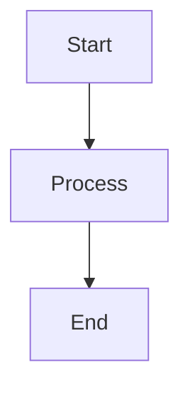

# LINAW Web Portal — Diagram Guide

This guide explains how to view and use the Mermaid diagrams included in this documentation folder.

---

## What is Mermaid?

[Mermaid](https://mermaid.js.org/) is a text-based diagram and chart syntax that renders visually in Markdown-supported tools. Diagrams are written as plain text code blocks with the language tag ` ```mermaid ` — no image exports or drawing tools required.

Example syntax:
```

```

---

## How to View Mermaid Diagrams

### In VS Code

**Option 1 (Recommended): Markdown Preview Mermaid Support**

Install the extension:
> [Markdown Preview Mermaid Support](https://marketplace.visualstudio.com/items?itemName=bierner.markdown-mermaid)
> Publisher: Matt Bierner
> Extension ID: `bierner.markdown-mermaid`

Steps:
1. Open VS Code
2. Go to Extensions (`Ctrl+Shift+X` / `Cmd+Shift+X`)
3. Search for `Markdown Preview Mermaid Support`
4. Click Install
5. Open any `.md` file in this `docs/` folder
6. Click the preview icon (top-right) or press `Ctrl+Shift+V` / `Cmd+Shift+V`
7. Mermaid diagrams render live in the preview panel

**Option 2: Mermaid Editor**

Install:
> [Mermaid Editor](https://marketplace.visualstudio.com/items?itemName=tomoyukim.vscode-mermaid-editor)
> Publisher: tomoyukim

This extension provides a dedicated editor and SVG export for Mermaid diagrams.

---

### On GitHub

GitHub renders Mermaid diagrams natively inside Markdown files with no extensions or plugins needed. Simply push the `docs/` folder to your repository and view any `.md` file on GitHub — the diagrams will render automatically.

---

### On Notion

Notion supports Mermaid through code blocks:
1. Type `/code` in Notion
2. Set the language to `mermaid`
3. Paste the Mermaid code block contents
4. Notion renders the diagram inline

---

### On Obsidian

Install the **Mermaid** community plugin or use the built-in support in Obsidian 1.4+:
- Paste the full ` ```mermaid ``` ` block into any note
- Toggle to Reading View to see the rendered diagram

---

### In a Browser (Standalone)

Visit [mermaid.live](https://mermaid.live/) — the official online editor. Paste any diagram code block to preview and export as PNG or SVG.

---

## How to Export Diagrams

| Tool | Export Method |
|---|---|
| VS Code (Mermaid Editor extension) | Right-click diagram → Save as SVG/PNG |
| mermaid.live | Click Actions → Download SVG or PNG |
| GitHub | Screenshot the rendered diagram from the browser |
| Notion | Screenshot or use Notion's export to PDF |

For dissertation figures and formal documentation, export as **SVG** (vector) for crisp rendering at any size, or **PNG** at 2x resolution for presentations.

---

## Files in This Documentation Folder

| File | Contents |
|---|---|
| [`SYSTEM_WORKFLOW.md`](SYSTEM_WORKFLOW.md) | Overall portal workflow — login, module navigation, submission lifecycle, feedback cycle |
| [`ROLE_BASED_WORKFLOW.md`](ROLE_BASED_WORKFLOW.md) | Separate workflow diagrams for CENRO, Secretary, Councilor, Captain, and Citizen |
| [`MODULE_INTERACTION_DIAGRAM.md`](MODULE_INTERACTION_DIAGRAM.md) | How all 13 modules connect to each other and to the data layer |
| [`DATA_FLOW_DIAGRAM.md`](DATA_FLOW_DIAGRAM.md) | Where data comes from, how it flows through contexts, and how it persists in localStorage |
| [`PDCA_WORKFLOW_MAPPING.md`](PDCA_WORKFLOW_MAPPING.md) | PDCA cycle mapped to portal modules — Plan / Do / Check / Act |
| [`README_DIAGRAM_GUIDE.md`](README_DIAGRAM_GUIDE.md) | This file — how to view and use diagrams |

---

## Using These Diagrams for Your Dissertation

### For the Proposal Defense / System Presentation

These diagrams are designed to support the following presentation scenarios:

**System Design Chapter**
- Use `SYSTEM_WORKFLOW.md` to explain how users interact with the portal end-to-end
- Use `MODULE_INTERACTION_DIAGRAM.md` to show the system architecture without needing a UML tool
- Use `DATA_FLOW_DIAGRAM.md` to justify the frontend-only prototype design and explain how a real backend would connect

**Methodology Chapter**
- Use `PDCA_WORKFLOW_MAPPING.md` to show that the portal is not just a reporting tool but a structured governance framework aligned with PDCA quality management

**User Roles and Access Control**
- Use `ROLE_BASED_WORKFLOW.md` to present the role-based access model for CENRO, barangay officials, and citizens

### For Technical Documentation

These diagrams serve as:
- **Architecture documentation** — reviewable by developers who will later connect a backend
- **Requirements traceability** — maps each system feature to a user role and workflow step
- **API planning guide** — the data flow diagrams show what entities need CRUD endpoints when a backend is introduced

---

## Recommended Diagram Viewer Setup (Quick Start)

```
1. Open VS Code
2. Cmd+Shift+X → search "bierner.markdown-mermaid" → Install
3. Open docs/SYSTEM_WORKFLOW.md
4. Cmd+Shift+V to open Markdown Preview
5. All diagrams render in the preview panel
```

That is all that is needed to view every diagram in this documentation folder locally.
