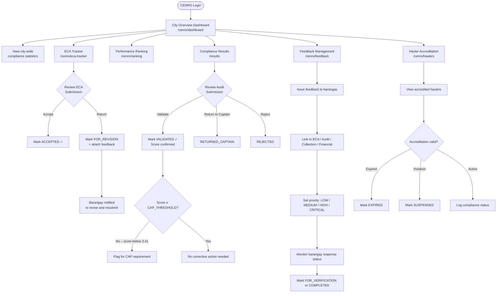
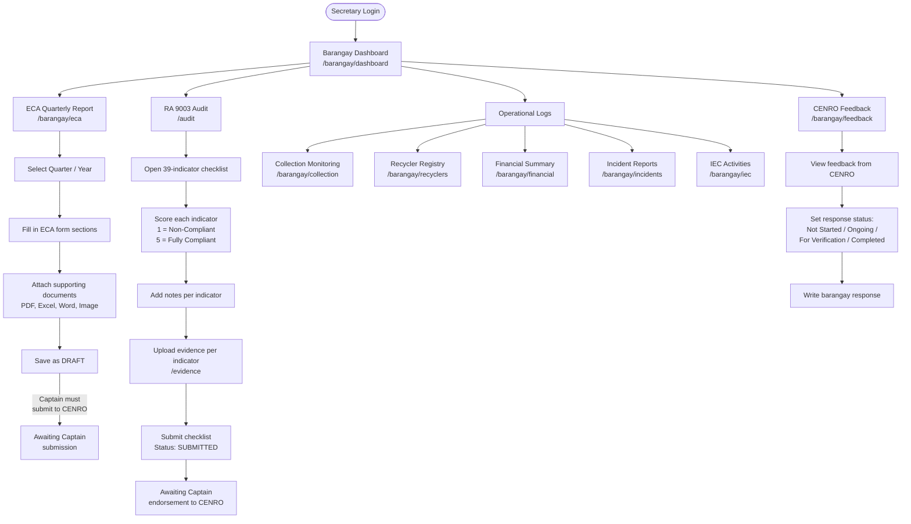
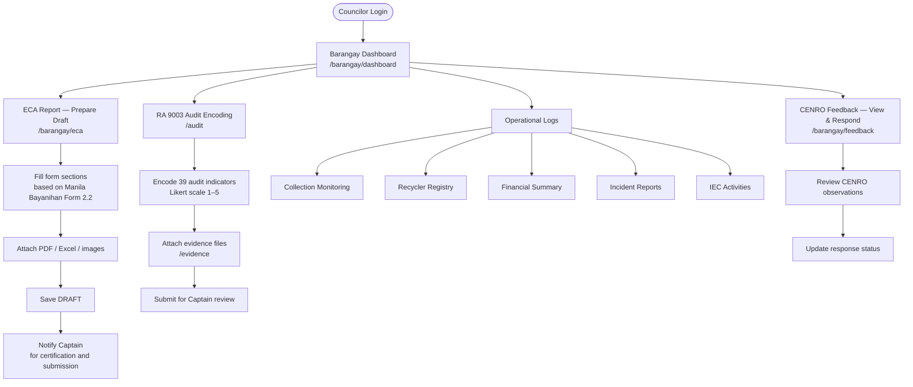
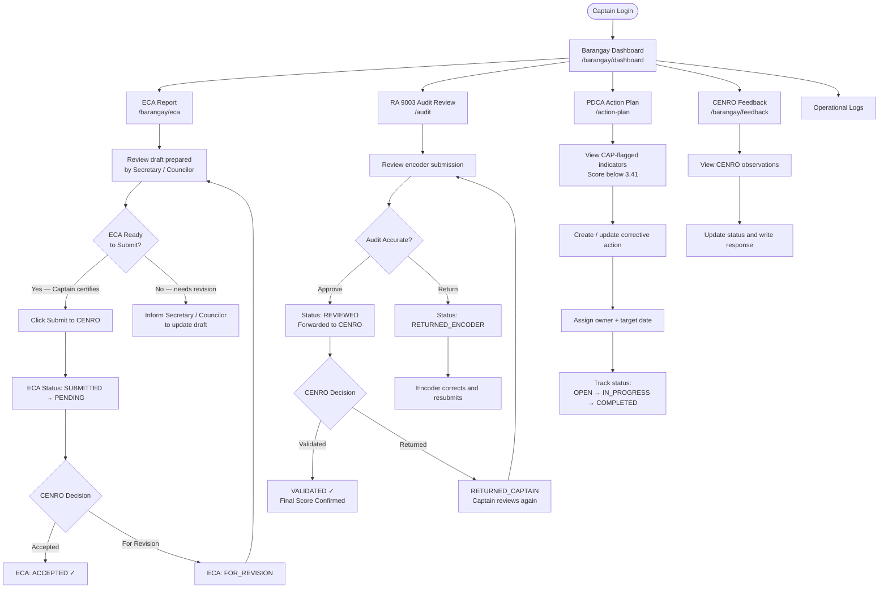
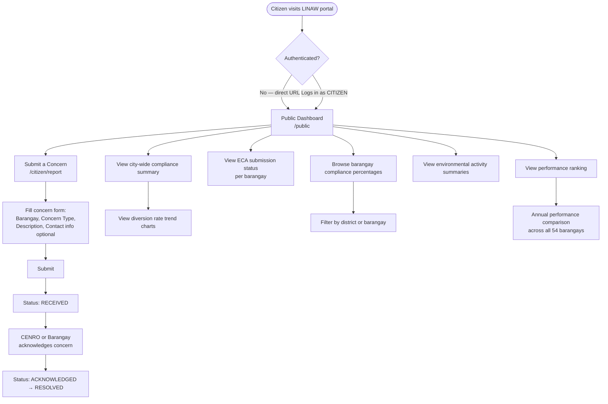

# LINAW Web Portal — Role-Based Workflow

This document describes what each user role can access and do within the LINAW Web Portal, based on the implemented routes, sidebar navigation, and RBAC guards.

---

## Roles Summary

| Role | Scope | Primary Function |
|---|---|---|
| `CENRO_EVALUATOR` | City-wide (all 54 barangays) | Monitor, review, validate, issue feedback |
| `BARANGAY_SECRETARY` | Own barangay only | Encode ECA form, log operational data |
| `BARANGAY_COUNCILOR` | Own barangay only | Encode ECA form, log operational data |
| `BARANGAY_CAPTAIN` | Own barangay only | Certify and submit reports to CENRO |
| `BARANGAY_ENCODER` | Own barangay only | Legacy encoder role (audit + ECA) |
| `SYSTEM_ADMIN` | System-wide | Full access + user management |
| `RESEARCHER` | Read-only analytics | Cross-barangay analysis, reports |
| `CITIZEN` | Public | View open data, submit concerns |

---

## 1. CENRO Evaluator

**Login redirects to:** `/cenro/dashboard`

### What CENRO Can Access
- City-wide compliance overview dashboard
- ECA submission tracker (all 54 barangays)
- Barangay performance ranking
- Hauler accreditation management
- Feedback and corrective action issuance
- RA 9003 audit compliance results
- Report generation

### Workflow

---

## 2. Barangay Secretary

**Login redirects to:** `/barangay/dashboard`

### What the Secretary Can Access
- Barangay dashboard (own barangay only)
- ECA quarterly report — **prepare and save drafts only** (cannot submit to CENRO)
- RA 9003 audit checklist encoding
- Evidence repository (upload per indicator)
- Waste collection monitoring log
- Recycler registry
- Financial summary
- Incident reports
- IEC activities log
- CENRO feedback (view and respond)

### Workflow

---

## 3. Barangay Councilor

**Login redirects to:** `/barangay/dashboard`

### What the Councilor Can Access
Identical to Barangay Secretary. The Councilor role is parallel to the Secretary — both prepare ECA forms and encode operational data. Neither can submit to CENRO (that is the Captain's role).

### Workflow

---

## 4. Barangay Captain

**Login redirects to:** `/barangay/dashboard`

### What the Captain Can Access
- All barangay pages
- **Submit ECA report to CENRO** (exclusive to Captain)
- **Endorse RA 9003 audit to CENRO** (reviews REVIEWED submissions)
- PDCA action plan tracking
- CENRO feedback (view and respond)

### Workflow

---

## 5. Citizen

**Access:** No login required for public pages.

### What the Citizen Can Access
- Open Data Public Dashboard (`/public`) — no authentication needed
- Citizen Concern Submission Form (`/citizen/report`) — no authentication needed
- Cannot access any barangay or CENRO administrative pages

### Workflow

---

## Access Matrix Summary

| Page / Module | CENRO | Secretary | Councilor | Captain | Encoder | Admin | Researcher | Citizen |
|---|:---:|:---:|:---:|:---:|:---:|:---:|:---:|:---:|
| `/cenro/dashboard` | ✓ | | | | | ✓ | | |
| `/cenro/eca-tracker` | ✓ | | | | | ✓ | | |
| `/cenro/ranking` | ✓ | | | | | ✓ | | |
| `/cenro/haulers` | ✓ | | | | | ✓ | | |
| `/cenro/feedback` | ✓ | | | | | ✓ | | |
| `/barangay/dashboard` | | ✓ | ✓ | ✓ | ✓ | | | |
| `/barangay/eca` (view+draft) | | ✓ | ✓ | ✓ | ✓ | | | |
| `/barangay/eca` (submit to CENRO) | | | | ✓ | | | | |
| `/audit` | | ✓ | ✓ | ✓ | ✓ | ✓ | ✓ | |
| `/evidence` | | ✓ | ✓ | ✓ | ✓ | ✓ | ✓ | |
| `/barangay/collection` | | ✓ | ✓ | ✓ | ✓ | | | |
| `/barangay/recyclers` | | ✓ | ✓ | ✓ | ✓ | | | |
| `/barangay/financial` | | ✓ | ✓ | ✓ | ✓ | | | |
| `/barangay/incidents` | | ✓ | ✓ | ✓ | ✓ | | | |
| `/barangay/iec` | | ✓ | ✓ | ✓ | ✓ | | | |
| `/barangay/feedback` | | ✓ | ✓ | ✓ | ✓ | | | |
| `/action-plan` | | | | ✓ | ✓ | ✓ | ✓ | |
| `/results` | ✓ | | | | | ✓ | ✓ | |
| `/reports` | ✓ | | | | | ✓ | ✓ | |
| `/rca` | | | | | | ✓ | ✓ | |
| `/users` | | | | | | ✓ | | |
| `/settings` | | | | | | ✓ | | |
| `/public` | | | | | | | | ✓ (open) |
| `/citizen/report` | | | | | | | | ✓ (open) |
